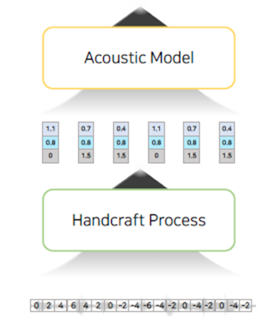

# 1주차 발표: Self-Supervised Learning

### CPC: Representation Learning with Contrastive Predictive Coding

.png)

Submitted on 10 Jul 2018

*기존의 음성 태스크의 처리 방법*

1. Handcraft Feature (Feature Extraction e.g. Mel-spectrogram, MFCC)
2. Acoustic Model (Train e.g. HMM, Vocoder)

*신호처리적이지 않은 음성 태스크의 처리 방법*

• Self-Supervised Learning

모델 성능 향상을 위해 레이블이 없는 데이터를 레이블이 있는 데이터와 함께 사용 

**음성 데이터만으로 음성의 특성을 추출할 수 있는 모델**

→ Handcraft Process를 대체 가능

• 음성 태스크에서의 Self-Supervised Learning의 활용 역사

***CPC: Representation Learning with Contrastive Predictive Coding***

• Self-Supervised Learning의 목적

데이터 내 Representation을 추출할 수 있는 모델

• 좋은‘Representation’ 이란?

일반적으로 상위 수준 정보는 중요한 데이터가 있고, 느리게 변한다.
→ 또한 이 데이터는 전체 데이터 내에서 *공유되는 정보*이다.
하위 정보에는 노이즈가 포함되어 있으며, 빠르게 변한다.

• 음성 태스크에서 Self-Supervised Learning의 목적

음성 데이터만으로 음성의 *공유되는 정보*를 추출할 수 있는 모델

• CPC 아키텍처(SSL)를 사용하여 공유 정보 추출

Encoder (CNN): 음성을 Feature Vector로 변환
Aggregator (RNN): Feature Vector를 Shared Vector로 변환

• 아키텍처 작동 방식

Shared Vector를 사용하여 일정 거리에서 Feature Vector 예측
Future Vector를 예측하기 위해 과거 Feature Vector내의 공유 정보 활용
추출된 Feature Vector를 사용하여 모델 학습 (이 경우 downstream task는 분류 사용)

***Wav2vec: Unsupervised Pre-training for Speech Recognition***

• CNN Aggregator 사용

Casual CNN을 활용하여 RNN과 유사한 효과 가능. 
병렬 처리 가능 → 모델 속도 향상

• Language Model 사용

각 모델 확률 합산: 확률이 가장 높은 단어 선택

• 데이터

음성-텍스트 Align 데이터(Acoustic Model 학습)
텍스트 전용(Language Model 학습)

***VQ-wav2vec: SLL of Discrete Speech Representations***

• Motivation

음성 태스크 수행 능력 향상을 위한 Sequence pattern 학습 필요
→ Masked Language Modeling(MLM) SSL?
• 입력 및 출력 길이는 Speech-Text 데이터에서 불일치 가능성이 존재한다.

• MLM SSL에 사용 가능한 discrete representation

wav2vec에 벡터 양자화 모델 추가
→ 이산 시퀀스 패턴 추출
MLM SSL(BERT) 구현: Acoustic & Language Model을 사용하여 Feature Vector 추출

***Wav2vec 2.0: A Framework for Self-Supervised Learning of Speech Representations***

• End-to-end Architecture

MLM과 CPC 통합
Transformer 아키텍처 사용
• 하나의 아키텍처에 Masking / Quantization 모델 포함

• Diversity Loss

Index (Codebook) 구현
1) 특정 index access에서 확률 $*p_{g,v}*$ 계산
2) 확률 $*p_{g,v}*$에서 Diversity Loss 계산
3) Diversity Loss를 Total Loss로 구현

***HuBERT: SSL Representation Learning by Masked Prediction of Hidden Units***

• Unique Hidden units 발견

텍스트 문장에서 단어/토큰을 대체 가능
• MFCC에서 k-means clustering 사용

클러스터링을 위해 intermediate layer feature 재사용 (Transformer)

• wav2vec 2.0과 HuBERT의 차이점

HuBERT는 cross-entropy loss 사용
(wav2vec 2.0은 Diversity Loss 사용)

HuBERT는 representation을 위한 별도의 클러스터링 프로세스가 존재 
(wav2vec 2.0이 학습하는 동시에 representation을 학습)

***GSLM: On Generative Spoken Language Modeling from Raw Audio***

**“Textless NLP”**

• Downstream Task에 구현

인코더 (S2u): speech wav를 discrete unit으로 변환
디코더 (u2S): discrete unit을 speech wav로 변환

uLM: discrete unit으로부터 후속에 나올 discrete unit을 생성 (Transformer)

• SOTA 인코더 활용

CPC, wav2vec 2.0, HuBERT
