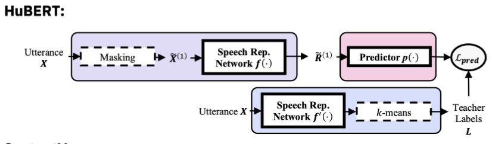
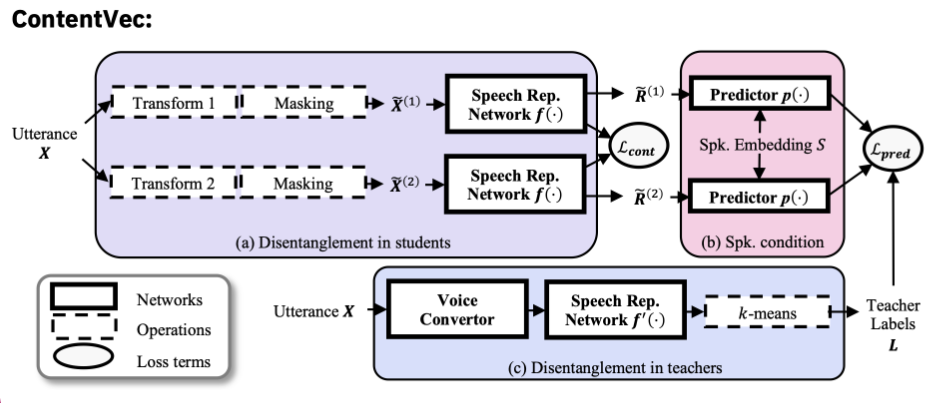
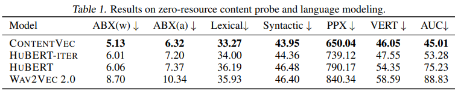
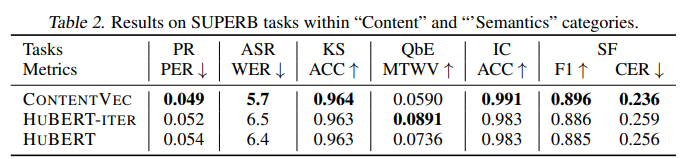
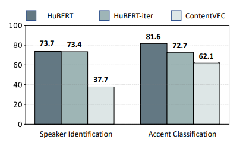

## 논문 정보
ContentVec: An Improved Self-Supervised Speech Representation by Disentangling Speakers / ICML 2022 

# Problem

Speech SSL의 downstream에는 content-related task가 많이 존재한다. 이 때문에 SSL Feature에서 speaker information과 content information의 disentanglement를 잘 하기 위한 방법은 중요한 연구주제이다. 하지만, speaker information을 없애는 과정에서 content information loss가 더 심하게 일어나기 쉽다. 

# Key Idea

SSL의 학습 과정 중에서 모델이 speaker information을 배우지 않도록 하자. Hubert의 학습 중에 음성이 feature extractor에 들어갈 때는 화자 정보를 숨기고, masked frame을 예측할 때는 화자 정보를 컨디션으로 주도록 하면, feature extractor는 화자 정보를 학습하려고 하지 않을 것이라는 주장

# Detail

먼저 저자는 이전 Hubert 모델의 학습 과정을 Teacher, Student, Predictor라는 세 컴포넌트로 쪼개서 설명한다. 

레이블을 만드는 Teacher Model, 마스킹된 음성에 대해서 representation을 만드는 student, representation을 사용해 마스킹된 프레임의 레이블을 예측하는 predictor이다. 

학습 도중 각 컴포넌트에서 disentanglement를 수행한다.

1. Teacher Component
	- Contentvec의 학습에는 이미 훈련이 완료된 hubert를 사용한다. 이 때, teacher model의 입력에 voice conversion을 수행하여 모든 발화에 대해 하나의 화자가 발화하는 것처럼 만들어 학습을 수행한다.
2. Student Component
	- Contrastive loss를 도입했다. 입력 샘플에 대해서 Formant transform - pitch shift - frequency shaping 순으로 content를 해치치 않는 선에서 random transformation을 수행 후에 contrastive loss를 도입한다.
3. Predictor Component
	- Pretrained speaker encoder를 사용하여 predictor의 입력으로 사용한다. 이를 통해서 student가 speaker 정보를 학습할 필요성을 더 줄인다.

# Result

## Zero Speech Evaluation

## SUPERB 

## Speaker Identification

Content Information이 중요한 태스크에서 베이스라인보다 더 좋은 결과를 보여줬으며, Speaker Identification에서 좋지 못한 성능을 나타내는 것이 해당 모델에 speaker information이 포함되지 않았다는 것을 보충하는 증거이다.